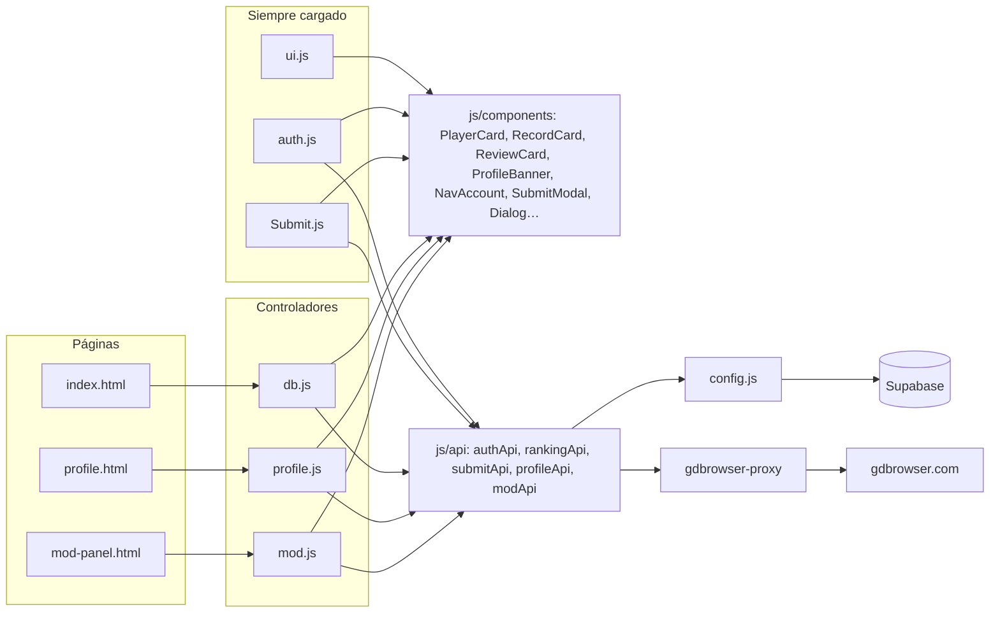
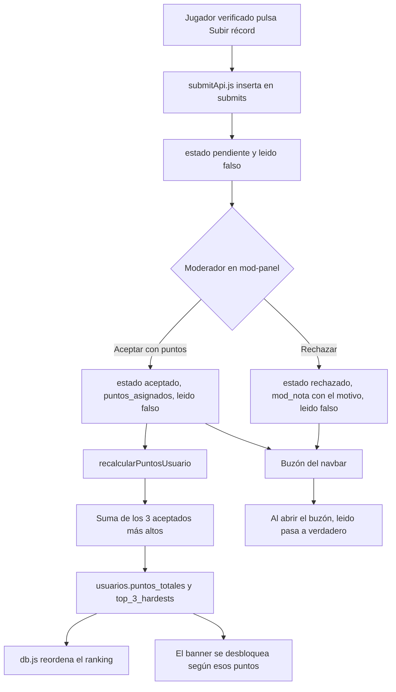

# GDNC List

GDNC List es un ranking de Geometry Dash: la gente entra con Discord, demuestra que el nombre de GD es suyo, manda un video de una completion y un moderador decide si suma puntos. Esos puntos ordenan el ranking y, de paso, desbloquean el banner del perfil.

No hay framework ni bundler. La página son tres HTML, módulos de JavaScript vanilla y Supabase (Auth, Postgres, Storage y una Edge Function). Si abres un archivo y sigues sus `import`, casi siempre llegas al sitio donde vive el comportamiento que estás buscando.

## Cómo está repartido el código

Cada pantalla carga los mismos cuatro cimientos y después su propio controlador:

| Pantalla | Qué muestra | Controlador |
| --- | --- | --- |
| `index.html` | Ranking y búsqueda | `js/db.js` |
| `profile.html?uid=...` | Banner, récords aceptados, comentarios, likes | `js/profile.js` |
| `mod-panel.html` | Cola de récords pendientes | `js/mod.js` |

Los tres HTML también cargan `js/config.js`, `js/ui.js`, `js/auth.js` y `js/Submit.js`. Esos no pintan el ranking ni el perfil: crean el cliente de Supabase, montan el pie de página, arman el navbar según quién esté logueado y añaden el modal para subir un récord.

La regla del proyecto es separar responsabilidades:

- Las llamadas a Supabase van en `js/api/`: `authApi.js` (sesión, buzón y verificación de GD), `rankingApi.js`, `submitApi.js`, `profileApi.js` y `modApi.js`.
- El HTML repetido va en `js/components/`: las tarjetas (`PlayerCard.js`, `RecordCard.js`, `ReviewCard.js`, `CommentItem.js`), el banner (`ProfileBanner.js`), la cuenta del navbar (`NavAccount.js`), el formulario de envío (`SubmitModal.js`), los diálogos (`Dialog.js`), los esqueletos de carga (`Skeleton.js`), el pie con el crédito (`SiteCredit.js`) y los iconos SVG (`icons.js`).
- El controlador de la vista (`auth.js`, `db.js`, `Submit.js`, `profile.js`, `mod.js`) solo coordina: pide datos, elige qué pintar y engancha eventos.
- Lo compartido que no habla con Supabase ni genera HTML propio vive suelto en `js/`: `format.js` (escapar texto, enlaces seguros, puntos y fechas), `utils.js` (estado de carga de un botón, copiar al portapapeles) y `modal.js` (abrir y cerrar modales, y mantener el foco dentro).



## Arrancar en local

Sirve la carpeta con cualquier servidor estático y entra por `http://localhost`. Live Server, `npx serve` o el servidor de VS Code valen. Abrir el HTML con `file://` rompe los módulos y, además, el modo desarrollo no se activa: solo mira si el hostname es `localhost` o `127.0.0.1`.

En local no hace falta compilar. El cliente de Supabase llega por CDN en `js/config.js`:

```js
import { createClient } from 'https://cdn.jsdelivr.net/npm/@supabase/supabase-js/+esm'
```

Ahí mismo están la URL del proyecto y la clave publicable. Esa clave está pensada para el navegador. La clave de servicio no debe entrar nunca en estos archivos.

### Si quieres cambiar el número de versión del pie

En `js/config.js`, la constante `APP_VERSION` es el texto que se ve a la derecha del pie de página (`v1.0.3 release`, por ejemplo). Lo pinta `mountSiteCredit()` de `js/components/SiteCredit.js`, que `ui.js` llama en cada página junto con el crédito “Hecho por…”. Cambia el string y recarga.

## Modo desarrollo

`IS_DEV_MODE` en `js/config.js` es verdadero solo en localhost. Cuando lo está, `getCurrentUser()` no llama a `supabase.auth.getUser()`: devuelve `DEV_USER`, cuyo `id` es `DEV_USER_ID`.

Ese id tiene que ser un `uid` real de la tabla `usuarios`. El rol, los puntos y el banner se leen de esa fila, no de un objeto falso. Por eso el navbar, el perfil y el panel de mods se comportan como si hubieras entrado con esa cuenta.

Hay un límite importante. Las escrituras siguen pasando por las políticas de Supabase. Si en localhost no hay una sesión de Discord de ese mismo usuario, vas a poder ver el perfil y el ranking, pero guardar un banner o aceptar un récord puede fallar en silencio. El propio `config.js` avisa de eso en la consola. La forma práctica de trabajar es iniciar sesión una vez en localhost con esa cuenta y dejar la sesión guardada.

En `js/mod.js`, si el usuario de desarrollo no tiene `rol = 'mod'`, el panel no se bloquea: solo escribe un warning y sigue. Fuera de localhost, alguien sin rol de mod ve un aviso de acceso restringido con un enlace de vuelta al ranking.

### Si quieres probar con otra cuenta

Cambia `DEV_USER_ID` en `js/config.js` por el `uid` de la fila que quieras suplantar. No hace falta tocar `auth.js`: todo el mundo pasa por `getCurrentUser()`.

## Sesión, navbar y la prueba de que el nombre de GD es tuyo

`js/auth.js` corre en las tres páginas. Al cargar, y otra vez cuando Supabase avisa `SIGNED_IN` o `SIGNED_OUT`, llama a `checkUserStatus()`.

Si no hay usuario, el botón “Iniciar sesión con Discord” llama a `signInWithOAuth` con `redirectTo: window.location.origin`. Discord devuelve a la misma página desde la que saliste.

Si hay usuario, se busca su fila en `usuarios` por `uid`. A partir de ahí hay dos caminos:

1. Falta `gd_username` o `gd_verificado` no es verdadero. Se abre `#gd-setup-modal` (ese modal solo existe en `index.html`) y no se pinta el navbar de jugador.
2. El perfil ya está verificado. `NavAccount()` reemplaza `#auth-section` por la campana del buzón y un menú de cuenta: el botón muestra avatar, nombre de GD y puntos, y al abrirlo lleva a tu perfil, al panel si `rol === 'mod'` y a cerrar sesión. `ui.js` abre y cierra el menú (clic fuera, Escape o salir con Tab).

Las consultas de este archivo están en `js/api/authApi.js`. El avatar se sincroniza solo. Si `user.user_metadata.avatar_url` de Discord no coincide con `usuarios.avatar_url`, `auth.js` actualiza la fila en silencio y usa la URL nueva en ese mismo render. Si la imagen se cae, el `onerror` del `` cambia a `DEFAULT_AVATAR` de `js/avatar.js` (`https://cdn.discordapp.com/embed/avatars/0.png`).

### Cómo se verifica el nombre de Geometry Dash

El jugador escribe su nombre. Al pulsar “Generar código”, `auth.js` arma un string `GDNC-` más seis caracteres y lo guarda en `usuarios.codigo_verificacion_gd`. El modal pasa del paso 1 al paso 2 (la etiqueta “Paso 1 de 2” cambia con él) y le pide que publique ese código en los comentarios de su perfil de GD. El botón “Copiar” lo deja en el portapapeles.

“Verificar y entrar” no habla con los servidores de RobTop desde el navegador. `buscarComentariosGD()` de `authApi.js` invoca la Edge Function `gdbrowser-proxy` con `{ gdName }`. La función, en `supabase/functions/gdbrowser-proxy/index.ts`, hace dos cosas:

1. `GET https://gdbrowser.com/api/profile/{nombre}?t={timestamp}` para sacar el `accountID`.
2. `GET https://gdbrowser.com/api/comments/{accountID}?type=profile&t={timestamp}` y devuelve esos comentarios.

El `?t=` es `Date.now()`. GDBrowser cachea; sin eso, un comentario recién publicado puede no aparecer.

De vuelta en el navegador, `auth.js` busca si algún `comentario.content` incluye el código. Si lo encuentra, guarda `gd_username`, pone `gd_verificado` en verdadero, borra el código y recarga. Si no, el mensaje de `#gd-error-msg` pide esperar un minuto y volver a intentar. Los comentarios tardan en propagarse y el nombre tiene que coincidir con el de la API.

### Si quieres cambiar el texto del modal de vinculación

El copy está en `index.html`, dentro de `#gd-setup-modal`. Los ids que el JS necesita son `gd-step-label`, `paso-1-gd` (un `<form>`: el código se genera en su `submit`), `gd-input-name`, `btn-generar-codigo`, `paso-2-gd`, `codigo-display`, `btn-copiar-codigo`, `btn-gd-back`, `btn-verificar-gd`, `gd-error-msg` y `btn-gd-dismiss` (“Salir sin enlazar”, que cierra la sesión). Puedes reescribir los párrafos; si renombras un id, `auth.js` deja de encontrar el nodo.

El formato del código sale de esta línea en `auth.js`:

```js
currentCodigo = 'GDNC-' + Math.random().toString(36).substring(2, 8).toUpperCase();
```

`GDNC-` es solo una etiqueta legible. La comprobación es un `includes` sobre el texto del comentario, así que el código generado y el que se busca tienen que ser el mismo string.

## El ciclo de un récord

Los puntos de un jugador no son la suma de todo lo que ha completado. Son la suma de sus **tres** récords aceptados con más `puntos_asignados`. Ese número se guarda en `usuarios.puntos_totales` y los tres niveles, en `usuarios.top_3_hardests` (un JSON con `nombre` y `puntos`). El ranking, la tarjeta y los banners leen esa columna ya calculada; no la recalculan al vuelo.



Un moderador también puede saltarse la cola. En el perfil de alguien, si quien mira tiene `rol = 'mod'`, aparece “Añadir récord”. Ese insert ya nace con `estado: 'aceptado'`. Editar puntos o borrar un récord desde el mismo perfil vuelve a calcular la suma. El cálculo vive en un solo sitio, `recalcularPuntosUsuario()` de `js/api/modApi.js`, y lo usan el panel y el perfil: top 3 aceptados, suma, y update de `puntos_totales` más `top_3_hardests`.

## Subir un récord

`js/Submit.js` corre en las tres páginas. Al cargar añade al `<body>` el modal que genera `SubmitModal()`, y `initSubmitButton()` muestra `#btn-open-submit` cuando hay sesión y la fila de `usuarios` ya tiene `gd_username`. Sin eso el botón sigue con el atributo `hidden`, que es como viene en el HTML. Cuando lo muestra, también pone `data-can-submit="true"` en el `<body>` y lanza el evento `gdnc:can-submit`: los estados vacíos del ranking y del perfil lo escuchan para enseñar su propio botón “Subir récord”.

El modal pide nombre del nivel, id y URL del video. Antes de enviar, `validar()` marca con `aria-invalid` los campos vacíos o mal escritos (el id solo admite dígitos y la URL tiene que empezar con `http`; si el jugador pega `youtu.be/...` sin protocolo, se le añade `https://`). `enviarRecord()` de `js/api/submitApi.js` hace el insert en `submits` con `user_uid`, `gd_username`, `nivel_nombre`, `nivel_id`, `video_url` y `estado: 'pendiente'`. Los puntos no los elige el jugador.

Si el envío sale bien, el formulario se cambia por una confirmación que se queda abierta hasta que el jugador elige “Subir otro” o “Listo”. Al cerrarla, el formulario se vacía para el siguiente récord.

### Si quieres cambiar los campos del formulario

El marcado está en `js/components/SubmitModal.js`: `submit-form`, `submit-lvl-name`, `submit-lvl-id`, `submit-video-url`, `submit-msg`, `btn-send-submit` y la vista `submit-success` con `btn-submit-another` y `btn-submit-done`. `Submit.js` lee esos ids tal cual. Un campo nuevo hay que añadirlo a `CAMPOS` en `Submit.js`, pasarlo a `enviarRecord()` y meterlo en el `insert` de `submitApi.js`; la columna tiene que existir en `submits`.

## El buzón

Cuando el perfil está verificado, `NavAccount()` pinta la campana `#btn-inbox` a la izquierda del menú de cuenta y `auth.js` añade el modal `#inbox-modal` al `<body>`.

La consulta (`obtenerMisEnvios()` en `authApi.js`) trae los `submits` de ese `user_uid`, del más nuevo al más viejo. El punto de no leído mira solo el primero de esa lista, y solo si `leido === false`. Su color sale de la clase `inbox-dot--{estado}`: verde para `aceptado`, rojo para `rechazado` y blanco para `pendiente`. La etiqueta accesible de la campana también nombra el estado (“Tus envíos, novedad: Aceptado”), así que la información no depende solo del color.

Al abrir el buzón se hace `update({ leido: true })` de todos los submits no leídos de ese usuario. Aceptar o rechazar en el panel pone `leido: false` a propósito, para que el punto vuelva a encenderse.

Cada ítem muestra el estado (con texto, no solo color), `nivel_nombre`, `nivel_id`, cuándo se envió y, si viene, `mod_nota`.

## Ranking

`js/db.js` pide el ranking con `obtenerRanking()` de `js/api/rankingApi.js`: `usuarios` con `gd_verificado = true`, ordenados por `puntos_totales` descendente. Mientras llega, `index.html` ya trae un esqueleto con la silueta del podio y de las primeras filas. Después parte el array en dos:

- Los tres primeros van a `#podium-container`.
- Del cuarto en adelante van a `#ranking-container`.

El podio se pinta en orden 1, 2, 3, que es el orden en que lo recorren un lector de pantalla y el tabulador. Quien pone al primero en el centro es el CSS, con `grid-column` dentro de `.podium-container.is-active` en `css/components/cards.css`. El número que se ve (`1`, `2`, `3`) viaja en el argumento `rank` de `PlayerCard`.

`PlayerCard` está en `js/components/PlayerCard.js`. Recibe el jugador y el puesto, y devuelve un string HTML: un `<a href="profile.html?uid=...">` con puesto, avatar, nombre de GD, usuario de Discord, los tres récords que suman y los puntos. Todo el texto que viene de la base pasa por `escapeHtml()`. Las clases `player-card--rank-1`, `--rank-2` y `--rank-3` solo se aplican a los tres primeros. El color de cada puesto sale de `--color-rank-1`, `--color-rank-2` y `--color-rank-3` en `css/main.css`.

Si `top_3_hardests` viene vacío, la tarjeta dice “Sin récords todavía”. Si no hay ningún jugador, o la consulta falla, `db.js` pinta un estado vacío o de error con su acción (“Subir récord” o “Reintentar”).

### Si quieres cambiar cómo se ve una tarjeta del ranking

El marcado está en `PlayerCard()`. Los nombres que el buscador y las animaciones esperan son `.player-card` y `.player-card__title`. La apariencia (borde de color, avatar, bloque de puntos, el podio grande) está en `css/components/cards.css`. Puedes cambiar el HTML interno con bastante libertad mientras esas dos clases sigan en su sitio.

### La búsqueda

`#search-input` lo escucha `js/ui.js`, no `db.js`. No vuelve a consultar Supabase: filtra las `.player-card` que ya están en el DOM, comparando el texto de `.player-card__title` (el nombre de GD).

Hay un debounce de 200 ms: cada tecla cancela el `setTimeout` anterior. Con cualquier texto, `#podium-container` pierde `is-active` (la clase de la que cuelga todo el estilo del podio) y gana `is-searching`, así que sus tres tarjetas pasan a verse como filas normales y un jugador del top 3 también sale en los resultados. Las tarjetas que no coinciden reciben `is-filtered-out`. Si no queda ninguna, `#search-empty` dice “Ningún jugador coincide con …”. Al vaciar el input el podio regresa.

### Animaciones

Viven en `css/components/animations.css` y son cortas a propósito: la entrada del podio (`podium-rise`), la apertura y el cierre de los modales (`modal-in` y `modal-out`, o `sheet-in` y `sheet-out` cuando en móvil el modal sube desde abajo), el menú de cuenta (`menu-in`), el brillo de los esqueletos y la salida de una tarjeta revisada en el panel (`card-out`). Con `prefers-reduced-motion: reduce`, `css/main.css` las deja prácticamente en cero.

## Perfiles

`profile.html` lee el `uid` del query string. Sin `?uid=`, o si el jugador no existe, la cabecera muestra un aviso con un enlace de vuelta al ranking. `cargarPerfilCompleto()` en `js/profile.js` hace tres comprobaciones:

- Si el `uid` de la sesión es el de la URL, `isOwner` es verdadero y aparece “Cambiar banner”.
- Si la fila del visitante tiene `rol = 'mod'`, `isMod` es verdadero. Eso enseña “Añadir récord” y los botones Editar / Borrar de cada récord, aunque estés viendo el perfil de otra persona.
- Después carga la fila del perfil y sus `submits` con `estado = 'aceptado'`, ordenados por puntos de mayor a menor.

La cabecera la arma `ProfileBanner()`: portada, avatar, nombre, Discord, la etiqueta de moderador y tres cifras (puesto, puntos y número de récords). El puesto sale de `obtenerPosicionEnRanking()` y llega un momento después; mientras, la cifra muestra un esqueleto. El fondo lo aplica `aplicarFondoBanner()`. Cada récord es un `RecordCard()` de `js/components/RecordCard.js`.

Los videos de YouTube se ven como miniatura con un botón de reproducir. El iframe (de `youtube-nocookie.com`) solo se carga al pulsarla, así un perfil con muchos récords no descarga un reproductor por tarjeta; ese cambio lo hace `ui.js`. `youtubeId()` entiende `watch?v=`, `youtu.be/`, `/shorts/`, `/live/` y `/embed/`. Medal y Twitch no se embeben: sale un botón “Ver en Medal.tv” o “Ver en Twitch”. Cualquier otra URL `http(s)` cae en “Abrir video”, y una URL que no sea `http(s)` no genera enlace.

Después de la tercera tarjeta, si hay más de tres récords, se inserta un separador “Otros récords”. Los tres primeros son los que suman los puntos; el resto es historial.

### Si quieres cambiar o agregar banners

Todo el catálogo está en `BANNER_REWARDS`, al inicio de `js/components/ProfileBanner.js`. Cada entrada es un objeto:

| Campo | Qué hace |
| --- | --- |
| `pts` | Puntos mínimos (`puntos_totales`) para desbloquearlo. `0` es el clásico, siempre disponible. |
| `id` | Lo que se guarda en `usuarios.banner_activo`. Tiene que ser único. |
| `nombre` | El texto de la etiqueta en el selector. |
| `imagen` | Ruta pública, por ejemplo `/img/banners/banner_10.svg`. `null` si no hay archivo. |
| `fallback` | Un `linear-gradient(...)` por si la imagen no carga o todavía no existe. |

Los premios actuales son 0, 25, 50, 100, 200, 300, 400, 600 y, al final, el personalizado de 800. El orden del array es el orden del modal.

Para un banner nuevo con archivo propio:

1. Mete el SVG o la imagen en `img/banners/`. Los nombres de los que ya existen (`banner_10.svg`, `banner_25.svg`…) vienen de umbrales anteriores y ya no coinciden con sus `pts`. Conviene dejarlos así: el `id` de cada entrada (`banner_10`, …) es lo que está guardado en `usuarios.banner_activo`, y cambiarlo deja sin banner a quien lo tenía puesto.
2. Añade un objeto a `BANNER_REWARDS` con un `id` nuevo, los `pts`, la ruta en `imagen` y un `fallback`.
3. No hace falta tocar `profile.js` ni `profileApi.js` para un banner de archivo. El modal se genera recorriendo el array, y al elegirlo se guarda ese `id` en `banner_activo`.

`resolverBanner()` busca el `id` guardado. Si esa entrada ya no existe, si el jugador ya no llega a los `pts`, o si eligió `custom` pero no hay `banner_custom_url`, vuelve al primer elemento del array (el clásico). Por eso bajar de puntos no deja un banner bloqueado puesto: la próxima visita se ve el de 0 pts, aunque la columna siga diciendo otro id hasta que elijan uno válido.

El fondo no es un `style="background-image: ..."` escrito a mano en el HTML. `aplicarFondoBanner()` pone la variable CSS `--banner-fallback` en el elemento y, si el banner tiene imagen, añade detrás del contenido un ``. Va en un `` y no como `background-image` porque así los GIF se animan. Encima, `.profile-banner::after` en `css/profile.css` pone un velo oscuro para que el nombre se lea. Cada opción del modal (`.banner-option`) usa la misma variable y su propia ``.

Si cambias el nombre de esa variable, actualiza a la vez `variablesDeBanner()` en `ProfileBanner.js` y las reglas de `.profile-banner` y `.banner-option` en `css/profile.css`.

El selector marca como “En uso” el banner que se ve en la portada, es decir, el que devuelve `resolverBanner()`, no el id guardado. Si alguien guardó un banner que ya no tiene desbloqueado, el selector y la portada coinciden en el clásico.

### El banner personalizado

La última entrada usa `id: 'custom'` (`CUSTOM_BANNER_ID`). No tiene imagen en el repo. Al desbloquearla (800 puntos) el modal ofrece subir un PNG, JPG, WEBP o GIF.

La subida está en `js/api/profileApi.js`:

- Bucket de Storage: `banners`.
- Ruta fija: `{uid}/custom`, con `upsert: true`, así que reemplaza la anterior.
- Límite en el cliente: `BANNER_MAX_BYTES` (5 MB) y `BANNER_MIME_TYPES`. El comentario del archivo pide que coincidan con `file_size_limit` y `allowed_mime_types` del bucket. Si solo cambias el número en JS, Storage puede rechazar igual el archivo.
- La URL pública lleva `?v=${Date.now()}`. El path no cambia entre subidas; sin ese query el navegador seguiría mostrando la imagen cacheada.

`profile.js` pinta el banner nuevo antes de esperar la respuesta y, si el update falla, restaura el id anterior. El mensaje de error sale en `#banner-feedback`.

### Si quieres mover el umbral de 800 puntos

Cambia el `pts` del objeto cuyo `id` es `'custom'` dentro de `BANNER_REWARDS`. De ahí sale `PUNTOS_BANNER_PERSONALIZADO`, que usan el candado del selector, el texto del modal y el mensaje de error de la subida, así que no hay ninguna frase que actualizar a mano. El servidor sigue siendo quien debe impedir que alguien con menos puntos escriba `banner_custom_url`; el `pts` del array solo es la regla de la interfaz.

## Comentarios y likes

En cada récord aceptado, el botón “Comentarios” abre `#comments-modal`. `profile.js` guarda el `submit_id` en `currentSubmitId`.

- Los likes son un `count` de `submit_likes` para ese `submit_id` (`obtenerInteracciones()` en `profileApi.js`). Si la sesión ya tiene fila, el botón se pinta marcado, con `aria-pressed="true"` y el texto “Te gusta”. Pulsar otra vez borra esa fila; si no existe, la inserta (`alternarMeGusta()`). Es un toggle, no un contador que se incrementa en la fila del récord. El botón cambia al momento y vuelve atrás si la escritura falla.
- Los comentarios salen de `comentarios` con el embed `usuarios ( gd_username, avatar_url )`, del más viejo al más nuevo, y cada uno lo pinta `CommentItem()`. Hace falta estar logueado para escribir; sin sesión, el formulario se cambia por un aviso. El insert lleva `submit_id`, `user_uid` y `texto`.

### Modales y diálogos

Todos los modales se abren y cierran con `abrirModal()` y `cerrarModal()` de `js/modal.js`. Guardan el elemento que tenía el foco, lo mantienen dentro del modal mientras está abierto (Tab y Shift+Tab dan la vuelta) y lo devuelven al cerrar. Se cierran con su botón y, si el overlay tiene `data-dismiss="backdrop"`, también con Escape y con un clic en el fondo. El de vinculación con GD no lo lleva a propósito: es un paso obligatorio. La salida dura 160 ms (`MODAL_MOTION_MS`), con la clase `is-closing`; al terminar, el overlay lanza el evento `modal:closed`.

Las confirmaciones no usan `alert()`, `confirm()` ni `prompt()`. `js/components/Dialog.js` tiene `confirmDialog()`, `promptDialog()` y `alertDialog()`, que devuelven una promesa y se ven como el resto de la página. Borrar un récord pide confirmación con el botón destructivo en rojo y el foco inicial en “Cancelar”.

## Panel de moderación

`mod-panel.html` carga `js/mod.js`, y ese archivo no habla con Supabase directo: pasa por `js/api/modApi.js`.

`verificarAccesoMod()` lee `usuarios.rol`. Si no es `'mod'` y no estás en localhost, el panel muestra un aviso de acceso restringido (distinto si no hay sesión o si la cuenta no es de moderador) con un enlace al ranking. No hay `alert()` ni redirección.

`obtenerSubmitsPendientes()` trae `submits` con `estado = 'pendiente'`, del más antiguo al más nuevo (`fecha_submit` ascendente). Mientras llegan se ven dos esqueletos, y el número de pendientes aparece junto al título. Cada tarjeta es un `ReviewCard()` de `js/components/ReviewCard.js`: la miniatura del video (si es de YouTube se reproduce ahí mismo), un enlace para abrirlo en otra pestaña y dos acciones:

- **Aceptar.** El input `pts-{submit_id}` es obligatorio y tiene que ser un entero mayor que 0; si no, el error sale debajo de la tarjeta. Enter en ese campo también acepta. `aceptarSubmit()` pone `estado: 'aceptado'`, `puntos_asignados`, `mod_nota: null`, `leido: false`, y luego recalcula los puntos de ese `user_uid`.
- **Rechazar.** Los controles principales se ocultan y aparece un `<select>` de motivos con “Cancelar” y “Confirmar rechazo”. `rechazarSubmit()` guarda el texto elegido en `mod_nota`, pasa el estado a `rechazado` y marca `leido: false`. No toca los puntos.

Al terminar, la tarjeta sale con `card-out` (240 ms, `SALIDA_MS` en `mod.js`) y el foco pasa al campo de puntos de la siguiente. Cuando no queda ninguna, el panel lo dice.

### Si quieres agregar un motivo de rechazo

Los motivos están en `MOTIVOS_RECHAZO`, al inicio de `js/components/ReviewCard.js`. `value` es exactamente el texto que se guarda en `mod_nota` y el que el jugador lee en el buzón; `label` es lo que ve el moderador en el `<select>`. Añadir un objeto ahí es suficiente; no hay una lista aparte.

## Qué espera el frontend de la base de datos

No hay migraciones SQL en el repo: el esquema vive en el proyecto de Supabase. Estas son las columnas que el JavaScript lee o escribe hoy. Si una falta, la pantalla que la usa se queda a medias.

**`usuarios`**

| Columna | Uso |
| --- | --- |
| `uid` | Igual al id de Supabase Auth. Es la clave con la que se busca todo. |
| `discord_username` | Se muestra bajo el nombre de GD. |
| `avatar_url` | Foto del navbar, la tarjeta y el perfil. Se refresca desde Discord al entrar. |
| `gd_username` | Nombre ya verificado. También se copia en cada submit. |
| `gd_verificado` | Sin esto el usuario no entra al ranking. |
| `codigo_verificacion_gd` | Código temporal. Se borra al verificar. |
| `rol` | `'mod'` desbloquea el panel y las herramientas del perfil. Cualquier otro valor se trata como jugador. |
| `puntos_totales` | Suma de los 3 récords aceptados más altos. |
| `top_3_hardests` | JSON `[{ nombre, puntos }, ...]` para las tarjetas del ranking. |
| `banner_activo` | Id de `BANNER_REWARDS`, o `'custom'`. |
| `banner_custom_url` | URL pública del archivo en Storage, con `?v=`. |

**`submits`**

| Columna | Uso |
| --- | --- |
| `submit_id` | Id del récord. Viaja en los botones como `data-id`. |
| `user_uid` | Dueño. |
| `gd_username` | Nombre en el momento del envío. |
| `nivel_nombre`, `nivel_id`, `video_url` | Lo que escribió el jugador o el mod. |
| `estado` | `pendiente`, `aceptado` o `rechazado`. |
| `puntos_asignados` | Los pone un mod al aceptar, o al crear el récord a mano. |
| `mod_nota` | Motivo de rechazo. En un aceptado se limpia a `null`. |
| `leido` | Controla el puntito del buzón. |
| `fecha_submit` | Orden de la cola de moderación. |

**`comentarios`**: `submit_id`, `user_uid`, `texto`, `creado_en`, y una relación que permite pedir `usuarios ( gd_username, avatar_url )` en el mismo select.

**`submit_likes`**: `id`, `submit_id`, `user_uid`. Una fila por persona y récord.

**Storage**: bucket público `banners`, objetos en `{uid}/custom`.

La Edge Function `gdbrowser-proxy` se despliega con la CLI de Supabase desde `supabase/functions/gdbrowser-proxy/`. El navegador la llama con `supabase.functions.invoke('gdbrowser-proxy', { body: { gdName } })`. CORS está abierto en la función porque la página y Supabase no comparten origen.

## CSS, sin perderse

`css/main.css` define las variables en `:root`: fondos (`--bg-base`, `--bg-surface`, `--bg-elevated`…), líneas (`--line-subtle`, `--line`, `--line-strong`), Discord (`--color-discord`), los colores del logo (`--color-brand-green`, `--color-brand-red`), el verde de los botones principales (`--color-action`), estados (`--color-positive`, `--color-danger`, `--color-pending`), texto (`--text-main`, `--text-muted`, `--text-placeholder`), oro/plata/bronce del podio, radios, sombras, tipografías, `z-index` y duraciones. Casi ningún componente usa un hex suelto si ya existe una variable. El mismo archivo trae las clases utilitarias (`d-flex`, `justify-between`, `text-center`, `text-muted`, `visually-hidden`…) y los ajustes para `prefers-reduced-motion`, `prefers-reduced-transparency` y `prefers-contrast: more`.

`css/layout.css` es el navbar, el contenedor, el logo (Poppins), el menú de cuenta y el pie de página. El navbar es de cristal, pero el `backdrop-filter` va en `.navbar::before` y no en `.navbar`: con el filtro en el padre, el panel del menú de cuenta (que es hijo suyo) ya no podría desenfocar la página que tiene detrás.

`css/components.css` solo hace `@import` de botones, inputs, badges, modales, cards, animaciones y el crédito. Un estilo nuevo de un botón va en `css/components/buttons.css`, no en un archivo suelto, y el HTML lo engancha con la clase que ya exista (`btn-primary`, `btn-outline`, `btn-ghost`, `btn-danger`…).

`css/profile.css` solo lo carga `profile.html`. Ahí viven el banner, las cifras del perfil, el modal de banners y la grilla de récords.

La convención del proyecto es no usar `style=""` salvo para un valor que de verdad se calcula en el momento. Hoy solo hay dos: `--banner-fallback` en las opciones de banner y `--progress` en la barra de progreso hacia el siguiente.

### Si quieres cambiar un color de toda la página

Edita la variable en `:root` dentro de `css/main.css`. `--color-action` es el verde de “Subir récord”, “Enviar” y el resto de botones principales. `--color-discord` tiñe el botón de login y los iconos de Discord. `--color-rank-1` y compañía solo afectan al podio.

## Detalles que ahorran un rato de bugs

- **Dos copias del cálculo de puntos.** `js/modApi.js` y `recalcularPerfil()` en `js/profile.js`. Misma fórmula, dos funciones.
- **El podio visual no sigue el orden del array.** `db.js` pinta segundo, primero, tercero. El puesto real va en el argumento `rank`.
- **Debounce de 250 ms** en el buscador, y **reflow** con `offsetWidth` cada vez que una clase de animación se quita y se vuelve a poner en el mismo instante. Lo mismo en el panel, al mostrar el formulario de rechazo.
- **Cierre de modales.** 300 ms con la clase `is-closing` antes de `display: none`. Si ocultas el modal al momento, la animación no se ve.
- **Cache de GDBrowser y del banner.** `Date.now()` en la Edge Function y `?v=` en la URL de Storage. Quitarlos hace que “ya lo publiqué” y “ya subí la imagen” parezcan rotos.
- **Banner optimista.** Se pinta y, si el `update` falla, se revierte. Si ves un flash de banner y luego el anterior, el fallo está en la sesión o en las políticas, no en el CSS.
- **`escapeHtml` en el perfil.** `ProfileBanner.js` escapa nombres antes de meterlos en HTML. `PlayerCard.js` y varias plantillas de `profile.js` interpolan texto de la base directo. Conviene no fiarse de eso si un nombre de nivel puede traer HTML.
- **Avatar caído.** El `onerror` apunta al embed default de Discord y luego se anula a sí mismo (`this.onerror = null`) para no entrar en bucle si ese default también falla.
- **Módulos en todas las páginas.** Los `<script>` llevan `type="module"`. Un archivo nuevo tiene que exportar e importar; un script clásico suelto no va a ver `supabase`.

## Dónde mirar primero

| Quiero… | Archivo |
| --- | --- |
| Cambiar claves, versión o el usuario de localhost | `js/config.js` |
| Tocar login, navbar, buzón o la verificación de GD | `js/auth.js` e `index.html` (`#gd-setup-modal`) |
| Reordenar o filtrar el ranking | `js/db.js` y `js/components/PlayerCard.js` |
| Animar tarjetas, búsqueda o cierre de modales | `js/ui.js` y `css/components/animations.css` |
| Cambiar el formulario de envío | `index.html` y `js/Submit.js` |
| Añadir un banner o mover sus puntos | `BANNER_REWARDS` en `js/components/ProfileBanner.js` y `img/banners/` |
| Cambiar el aspecto del banner | `css/profile.css` (`.profile-banner`) |
| Subir la imagen personalizada | `js/api/profileApi.js` |
| Aceptar, rechazar o recalcular puntos | `js/mod.js` y `js/modApi.js` |
| Comentarios, likes y récords del perfil | `js/profile.js` |
| Colores globales | `:root` en `css/main.css` |
| La proxy hacia GDBrowser | `supabase/functions/gdbrowser-proxy/index.ts` |
