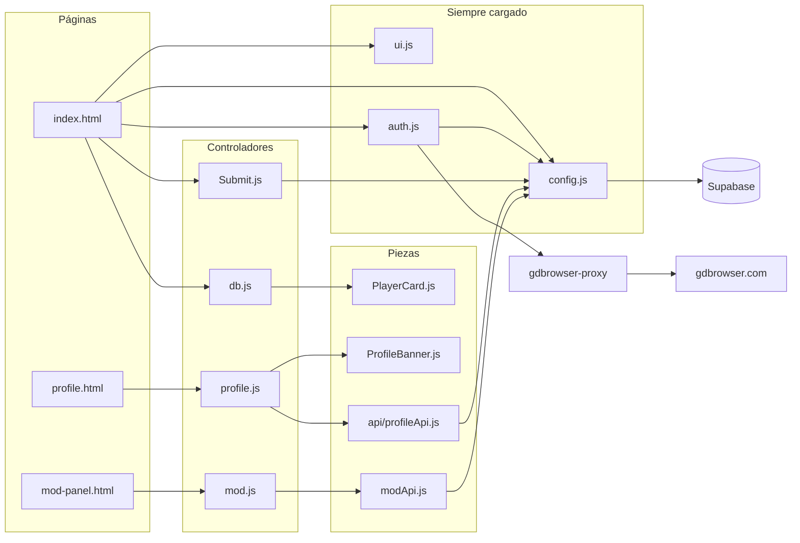
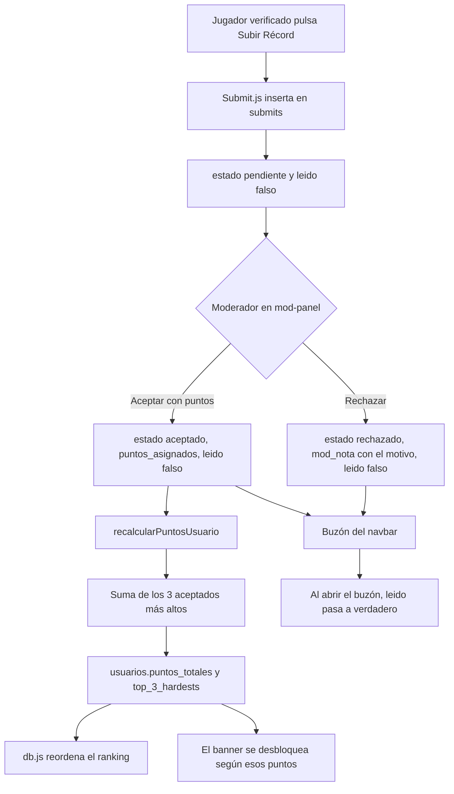

# GDNC List

GDNC List es un ranking de Geometry Dash: la gente entra con Discord, demuestra que el nombre de GD es suyo, manda un video de una completion y un moderador decide si suma puntos. Esos puntos ordenan el ranking y, de paso, desbloquean el banner del perfil.

No hay framework ni bundler. La página son tres HTML, módulos de JavaScript vanilla y Supabase (Auth, Postgres, Storage y una Edge Function). Si abres un archivo y sigues sus `import`, casi siempre llegas al sitio donde vive el comportamiento que estás buscando.

## Cómo está repartido el código

Cada pantalla carga los mismos tres cimientos y después su propio controlador:

| Pantalla | Qué muestra | Controlador |
| --- | --- | --- |
| `index.html` | Ranking, búsqueda, modal para subir un récord | `js/db.js` y `js/Submit.js` |
| `profile.html?uid=...` | Banner, récords aceptados, comentarios, likes | `js/profile.js` |
| `mod-panel.html` | Cola de récords pendientes | `js/mod.js` |

Los tres HTML también cargan `js/config.js`, `js/ui.js` y `js/auth.js`. Esos no pintan el ranking ni el perfil: crean el cliente de Supabase, animan la interfaz compartida y arman el navbar según quién esté logueado.

La regla del proyecto es separar responsabilidades:

- Las llamadas a Supabase van en `js/api/` (hoy `profileApi.js`; el panel de mods usa `js/modApi.js`, que todavía vive un nivel arriba).
- El HTML repetido va en `js/components/` (`PlayerCard.js`, `ProfileBanner.js`).
- El controlador de la vista (`db.js`, `profile.js`, `mod.js`) solo coordina: pide datos, elige qué pintar y engancha eventos.



## Arrancar en local

Sirve la carpeta con cualquier servidor estático y entra por `http://localhost`. Live Server, `npx serve` o el servidor de VS Code valen. Abrir el HTML con `file://` rompe los módulos y, además, el modo desarrollo no se activa: solo mira si el hostname es `localhost` o `127.0.0.1`.

En local no hace falta compilar. El cliente de Supabase llega por CDN en `js/config.js`:

```js
import { createClient } from 'https://cdn.jsdelivr.net/npm/@supabase/supabase-js/+esm'
```

Ahí mismo están la URL del proyecto y la clave publicable. Esa clave está pensada para el navegador. La clave de servicio no debe entrar nunca en estos archivos.

### Si quieres cambiar el número de versión de la esquina

En `js/config.js`, la constante `APP_VERSION` es el texto que `js/ui.js` pinta fijo abajo a la derecha (`v1.0.2 release`, por ejemplo). `ui.js` no lee nada más: cambia el string y recarga.

## Modo desarrollo

`IS_DEV_MODE` en `js/config.js` es verdadero solo en localhost. Cuando lo está, `getCurrentUser()` no llama a `supabase.auth.getUser()`: devuelve `DEV_USER`, cuyo `id` es `DEV_USER_ID`.

Ese id tiene que ser un `uid` real de la tabla `usuarios`. El rol, los puntos y el banner se leen de esa fila, no de un objeto falso. Por eso el navbar, el perfil y el panel de mods se comportan como si hubieras entrado con esa cuenta.

Hay un límite importante. Las escrituras siguen pasando por las políticas de Supabase. Si en localhost no hay una sesión de Discord de ese mismo usuario, vas a poder ver el perfil y el ranking, pero guardar un banner o aceptar un récord puede fallar en silencio. El propio `config.js` avisa de eso en la consola. La forma práctica de trabajar es iniciar sesión una vez en localhost con esa cuenta y dejar la sesión guardada.

En `js/mod.js`, si el usuario de desarrollo no tiene `rol = 'mod'`, el panel no redirige al inicio: solo escribe un warning y sigue. Fuera de localhost, alguien sin rol de mod es mandado a `index.html`.

### Si quieres probar con otra cuenta

Cambia `DEV_USER_ID` en `js/config.js` por el `uid` de la fila que quieras suplantar. No hace falta tocar `auth.js`: todo el mundo pasa por `getCurrentUser()`.

## Sesión, navbar y la prueba de que el nombre de GD es tuyo

`js/auth.js` corre en las tres páginas. Al cargar, y otra vez cuando Supabase avisa `SIGNED_IN` o `SIGNED_OUT`, llama a `checkUserStatus()`.

Si no hay usuario, el botón “Iniciar sesión con Discord” llama a `signInWithOAuth` con `redirectTo: window.location.origin`. Discord devuelve a la misma página desde la que saliste.

Si hay usuario, se busca su fila en `usuarios` por `uid`. A partir de ahí hay dos caminos:

1. Falta `gd_username` o `gd_verificado` no es verdadero. Se abre `#gd-setup-modal` (ese modal solo existe en `index.html`) y no se pinta el navbar de jugador.
2. El perfil ya está verificado. Se reemplaza `#auth-section` por avatar, nombre de GD, rol, puntos, logout y, si `rol === 'mod'`, el botón al panel. También aparece el buzón.

El avatar se sincroniza solo. Si `user.user_metadata.avatar_url` de Discord no coincide con `usuarios.avatar_url`, `auth.js` actualiza la fila en silencio y usa la URL nueva en ese mismo render. Si la imagen se cae, el `onerror` del `` cambia a `https://cdn.discordapp.com/embed/avatars/0.png`.

### Cómo se verifica el nombre de Geometry Dash

El jugador escribe su nombre. Al pulsar “Generar Código”, `auth.js` arma un string `GDNC-` más seis caracteres y lo guarda en `usuarios.codigo_verificacion_gd`. El modal pasa del paso 1 al paso 2 y le pide que publique ese código en los comentarios de su perfil de GD.

“Verificar y Entrar” no habla con los servidores de RobTop desde el navegador. Invoca la Edge Function `gdbrowser-proxy` con `{ gdName }`. La función, en `supabase/functions/gdbrowser-proxy/index.ts`, hace dos cosas:

1. `GET https://gdbrowser.com/api/profile/{nombre}?t={timestamp}` para sacar el `accountID`.
2. `GET https://gdbrowser.com/api/comments/{accountID}?type=profile&t={timestamp}` y devuelve esos comentarios.

El `?t=` es `Date.now()`. GDBrowser cachea; sin eso, un comentario recién publicado puede no aparecer.

De vuelta en el navegador, `auth.js` busca si algún `comentario.content` incluye el código. Si lo encuentra, guarda `gd_username`, pone `gd_verificado` en verdadero, borra el código y recarga. Si no, el mensaje de `#gd-error-msg` pide esperar un minuto y volver a intentar. Los comentarios tardan en propagarse y el nombre tiene que coincidir con el de la API.

### Si quieres cambiar el texto del modal de vinculación

El copy está en `index.html`, dentro de `#gd-setup-modal`. Los ids que el JS necesita son `gd-input-name`, `btn-generar-codigo`, `paso-1-gd`, `paso-2-gd`, `codigo-display`, `btn-verificar-gd` y `gd-error-msg`. Puedes reescribir los párrafos; si renombras un id, `auth.js` deja de encontrar el nodo.

El formato del código sale de esta línea en `auth.js`:

```js
currentCodigo = "GDNC-" + Math.random().toString(36).substring(2, 8).toUpperCase();
```

`GDNC-` es solo una etiqueta legible. La comprobación es un `includes` sobre el texto del comentario, así que el código generado y el que se busca tienen que ser el mismo string.

## El ciclo de un récord

Los puntos de un jugador no son la suma de todo lo que ha completado. Son la suma de sus **tres** récords aceptados con más `puntos_asignados`. Ese número se guarda en `usuarios.puntos_totales` y los tres niveles, en `usuarios.top_3_hardests` (un JSON con `nombre` y `puntos`). El ranking, la tarjeta y los banners leen esa columna ya calculada; no la recalculan al vuelo.



Un moderador también puede saltarse la cola. En el perfil de alguien, si quien mira tiene `rol = 'mod'`, aparece “Añadir Récord Manual”. Ese insert ya nace con `estado: 'aceptado'`. Editar puntos o borrar un récord desde el mismo perfil vuelve a calcular la suma. Esa segunda copia del cálculo vive en `recalcularPerfil()` dentro de `js/profile.js`. La del panel está en `recalcularPuntosUsuario()` dentro de `js/modApi.js`. Hacen lo mismo: top 3 aceptados, suma, y update de `puntos_totales` más `top_3_hardests`. Si cambias la fórmula, cámbiala en los dos sitios.

## Subir un récord

`js/Submit.js` solo corre en el index. `initSubmitButton()` muestra `#btn-open-submit` cuando hay sesión y la fila de `usuarios` ya tiene `gd_username`. Sin eso el botón sigue en `display: none`, que es como viene en el HTML.

El modal pide nombre del nivel, id y URL del video. El insert en `submits` manda `user_uid`, `gd_username`, `nivel_nombre`, `nivel_id`, `video_url` y `estado: 'pendiente'`. Los puntos no los elige el jugador.

### Si quieres cambiar los campos del formulario

Están en `index.html`, modal `#submit-modal`: `submit-lvl-name`, `submit-lvl-id`, `submit-video-url`, `btn-send-submit` y `submit-msg`. `Submit.js` lee esos ids tal cual. Un campo nuevo hay que leerlo ahí y meterlo en el objeto del `insert`, y la columna tiene que existir en `submits`.

## El buzón

Cuando el perfil está verificado, `auth.js` crea el botón `#btn-inbox` al lado del logo (envuelve el logo en `.nav-brand` si todavía no existe) y el modal `#inbox-modal`.

La consulta trae los `submits` de ese `user_uid`, del más nuevo al más viejo. El puntito de no leído mira solo el primero de esa lista, y solo si `leido === false`:

- `aceptado` → clase `inbox-dot--green`
- `rechazado` → `inbox-dot--red`
- cualquier otro estado, en la práctica `pendiente` → `inbox-dot--yellow`

Al abrir el buzón se hace `update({ leido: true })` de todos los submits no leídos de ese usuario. Aceptar o rechazar en el panel pone `leido: false` a propósito, para que el puntito vuelva a encenderse.

Cada ítem muestra `estado`, `nivel_nombre`, `nivel_id` y, si viene, `mod_nota`.

## Ranking

`js/db.js` pide `usuarios` con `gd_verificado = true`, ordenados por `puntos_totales` descendente. Parte el array en dos:

- Los tres primeros van a `#podium-container`.
- Del cuarto en adelante van a `#ranking-container`.

El podio no se pinta en orden 1, 2, 3. Se reordena a **2, 1, 3** para que el primer lugar quede al centro cuando el CSS pone las tres tarjetas en fila. El número que se ve (`#1`, `#2`, `#3`) viaja aparte, en el argumento `rank` de `PlayerCard`. Si algún día el podio pasa a ser una columna, ese reorden ya no hace falta.

`PlayerCard` está en `js/components/PlayerCard.js`. Recibe el jugador y el puesto, y devuelve un string HTML: un `<a href="profile.html?uid=...">` con rango, avatar, nombre de GD, usuario de Discord, los hardests y los puntos. Las clases `player-card--rank-1`, `--rank-2` y `--rank-3` solo se aplican a los tres primeros. El color de cada puesto sale de `--color-rank-1`, `--color-rank-2` y `--color-rank-3` en `css/main.css`, y el layout del podio está en `css/components/cards.css` bajo `.podium-container.is-active`.

Si `top_3_hardests` viene vacío, la tarjeta dice “Sin récords registrados”.

Después de inyectar el HTML, `db.js` llama a `observarTarjetas()` de `ui.js`.

### Si quieres cambiar cómo se ve una tarjeta del ranking

El marcado está en `PlayerCard()`. Los nombres que el buscador y las animaciones esperan son `.player-card` y `.player-card__title`. La apariencia (borde de color, avatar, bloque de puntos, el podio grande) está en `css/components/cards.css`. Puedes cambiar el HTML interno con bastante libertad mientras esas dos clases sigan en su sitio.

### La búsqueda

`#search-input` lo escucha `js/ui.js`, no `db.js`. No vuelve a consultar Supabase: filtra las `.player-card` que ya están en el DOM, comparando el texto de `.player-card__title` (el nombre de GD).

Hay un debounce de 250 ms. Cada tecla cancela el `setTimeout` anterior, así que la animación no se dispara en cada letra. Con cualquier texto, `#podium-container` pierde `is-active` y gana `is-searching`, que lo oculta; al vaciar el input el podio regresa.

Las tarjetas que dejan de coincidir reciben `fade-out` y, 300 ms después, `display: none`. Las que vuelven a coincidir se muestran otra vez con `is-visible`, escalonadas de 50 ms en 50 ms. Para que la animación CSS se reinicie, el código lee `card.offsetWidth` (`void card.offsetWidth`). Eso obliga al navegador a aplicar el estilo actual antes de volver a añadir la clase. Sin ese reflow, quitar y poner `is-visible` en el mismo frame no se nota.

### Animación al hacer scroll

`observarTarjetas()` observa cada `.player-card` con un `IntersectionObserver`. Cuando entra un 10 % de la tarjeta (con 50 px de margen inferior), le añade `animate-on-scroll` / `is-visible` y deja de observarla. El keyframe `fadeInUp` está en `css/components/animations.css`. El retraso `index * 50` solo escalona las tarjetas que cruzan el umbral juntas.

## Perfiles

`profile.html` lee el `uid` del query string. Sin `?uid=` el banner muestra “Usuario no especificado.” `cargarPerfilCompleto()` en `js/profile.js` hace tres comprobaciones:

- Si el `uid` de la sesión es el de la URL, `isOwner` es verdadero y aparece “Cambiar Banner”.
- Si la fila del visitante tiene `rol = 'mod'`, `isMod` es verdadero. Eso enseña “Añadir Récord Manual” y los botones Editar / Borrar de cada récord, aunque estés viendo el perfil de otra persona.
- Después carga la fila del perfil y sus `submits` con `estado = 'aceptado'`, ordenados por puntos de mayor a menor.

El banner lo arma `ProfileBanner()` y el fondo lo aplica `aplicarFondoBanner()`. El historial de récords, en cambio, se concatena dentro de `profile.js`: todavía no hay un `RecordCard.js`.

YouTube se convierte en iframe. Si la URL trae `watch?v=` se cambia por `embed/`; si trae `youtu.be/` se cambia por `youtube.com/embed/`. Medal y Twitch no se embeben: sale un botón “Ver en Medal.tv” o “Ver en Twitch” con color fijo. Cualquier otra URL cae en “Ver enlace externo”.

Después de la tercera tarjeta, si hay más de tres récords, se inserta un separador “Otras Récords”. Los tres primeros son los que más pesan en los puntos; el resto es historial.

### Si quieres cambiar o agregar banners

Todo el catálogo está en `BANNER_REWARDS`, al inicio de `js/components/ProfileBanner.js`. Cada entrada es un objeto:

| Campo | Qué hace |
| --- | --- |
| `pts` | Puntos mínimos (`puntos_totales`) para desbloquearlo. `0` es el clásico, siempre disponible. |
| `id` | Lo que se guarda en `usuarios.banner_activo`. Tiene que ser único. |
| `nombre` | El texto de la etiqueta en el selector. |
| `imagen` | Ruta pública, por ejemplo `/img/banners/banner_10.svg`. `null` si no hay archivo. |
| `fallback` | Un `linear-gradient(...)` por si la imagen no carga o todavía no existe. |

Los premios actuales son 0, 10, 25, 50, 100, 200, 400, 800 y, al final, el personalizado de 1200. El orden del array es el orden del modal.

Para un banner nuevo con archivo propio:

1. Mete el SVG o la imagen en `img/banners/`. Los que ya existen siguen el nombre `banner_{puntos}.svg`.
2. Añade un objeto a `BANNER_REWARDS` con un `id` nuevo, los `pts`, la ruta en `imagen` y un `fallback`.
3. No hace falta tocar `profile.js` ni `profileApi.js` para un banner de archivo. El modal se genera recorriendo el array, y al elegirlo se guarda ese `id` en `banner_activo`.

`resolverBanner()` busca el `id` guardado. Si esa entrada ya no existe, si el jugador ya no llega a los `pts`, o si eligió `custom` pero no hay `banner_custom_url`, vuelve al primer elemento del array (el clásico). Por eso bajar de puntos no deja un banner bloqueado puesto: la próxima visita se ve el de 0 pts, aunque la columna siga diciendo otro id hasta que elijan uno válido.

El fondo no es un `style="background-image: ..."` escrito a mano en el HTML. `aplicarFondoBanner()` pone dos variables CSS en el elemento, `--banner-image` y `--banner-fallback`. Quien las consume es `.profile-banner` en `css/profile.css`: encima de la imagen hay dos degradados oscuros para que el nombre se lea, y debajo el fallback. Las mismas variables se usan en cada opción del modal (`.banner-option`).

Si cambias nombres de esas variables, actualiza a la vez `variablesDeBanner()` en `ProfileBanner.js` y el `background-image` de `.profile-banner`.

### El banner personalizado

La última entrada usa `id: 'custom'` (`CUSTOM_BANNER_ID`). No tiene imagen en el repo. Al desbloquearla (1200 puntos) el modal ofrece subir un PNG, JPG o WEBP.

La subida está en `js/api/profileApi.js`:

- Bucket de Storage: `banners`.
- Ruta fija: `{uid}/custom`, con `upsert: true`, así que reemplaza la anterior.
- Límite en el cliente: `BANNER_MAX_BYTES` (5 MB) y `BANNER_MIME_TYPES`. El comentario del archivo pide que coincidan con `file_size_limit` y `allowed_mime_types` del bucket. Si solo cambias el número en JS, Storage puede rechazar igual el archivo.
- La URL pública lleva `?v=${Date.now()}`. El path no cambia entre subidas; sin ese query el navegador seguiría mostrando la imagen cacheada.

`profile.js` pinta el banner nuevo antes de esperar la respuesta y, si el update falla, restaura el id anterior. El mensaje de error sale en `#banner-feedback`.

### Si quieres mover el umbral de 1200 puntos

Cambia el `pts` del objeto cuyo `id` es `'custom'` dentro de `BANNER_REWARDS`. El selector usa ese número para el candado. El texto de error de la subida, en `onArchivoBanner()` de `profile.js`, menciona “1200 puntos” a mano: si mueves el umbral, actualiza también esa frase. El servidor sigue siendo quien debe impedir que alguien con menos puntos escriba `banner_custom_url`; el `pts` del array solo es la regla de la interfaz.

## Comentarios y likes

En cada récord aceptado, el botón “Comentarios” abre `#comments-modal`. `profile.js` guarda el `submit_id` en `currentSubmitId`.

- Los likes son un `count` de `submit_likes` para ese `submit_id`. Si la sesión ya tiene fila, el corazón se pinta relleno. Pulsar otra vez borra esa fila; si no existe, la inserta. Es un toggle, no un contador que se incrementa en la fila del récord.
- Los comentarios salen de `comentarios` con el embed `usuarios ( gd_username, avatar_url )`, del más viejo al más nuevo. Hace falta estar logueado para escribir. El insert lleva `submit_id`, `user_uid` y `texto`.

El modal se cierra con la X. El clic en el fondo oscuro de cualquier `.modal-overlay` lo cierra `ui.js`, con la clase `is-closing` y 300 ms de espera, que es la duración de la animación de salida.

## Panel de moderación

`mod-panel.html` carga `js/mod.js`, y ese archivo no habla con Supabase directo: pasa por `js/modApi.js`.

`verificarAccesoMod()` lee `usuarios.rol`. Si no es `'mod'` y no estás en localhost, hay un alert y un `location.replace('index.html')`.

`obtenerSubmitsPendientes()` trae `submits` con `estado = 'pendiente'`, del más antiguo al más nuevo (`fecha_submit` ascendente). Cada tarjeta deja ver el video en una pestaña nueva y ofrece dos acciones:

- **Aceptar.** El input `pts-{submit_id}` es obligatorio y tiene que ser un entero mayor que 0. `aceptarSubmit()` pone `estado: 'aceptado'`, `puntos_asignados`, `mod_nota: null`, `leido: false`, y luego recalcula los puntos de ese `user_uid`.
- **Rechazar.** Primero se ocultan los controles principales (fade de 300 ms, otra vez con `offsetWidth` para arrancar la transición) y aparece un `<select>` de motivos. `rechazarSubmit()` guarda el texto elegido en `mod_nota`, pasa el estado a `rechazado` y marca `leido: false`. No toca los puntos.

### Si quieres agregar un motivo de rechazo

Los `<option>` están armados como HTML en `cargarPendientes()`, dentro de `js/mod.js`, en el `<select id="reason-${submit.submit_id}">`. El `value` es exactamente el texto que se guarda en `mod_nota` y el que el jugador lee en el buzón. Añadir una opción ahí es suficiente; no hay una lista aparte.

## Qué espera el frontend de la base de datos

No hay migraciones SQL en el repo: el esquema vive en el proyecto de Supabase. Estas son las columnas que el JavaScript lee o escribe hoy. Si una falta, la pantalla que la usa se queda a medias.

**`usuarios`**

| Columna | Uso |
| --- | --- |
| `uid` | Igual al id de Supabase Auth. Es la clave con la que se busca todo. |
| `discord_username` | Se muestra bajo el nombre de GD. |
| `avatar_url` | Foto del navbar, la tarjeta y el perfil. Se refresca desde Discord al entrar. |
| `gd_username` | Nombre ya verificado. También se copia en cada submit. |
| `gd_verificado` | Sin esto el usuario no entra al ranking. |
| `codigo_verificacion_gd` | Código temporal. Se borra al verificar. |
| `rol` | `'mod'` desbloquea el panel y las herramientas del perfil. Cualquier otro valor se trata como jugador. |
| `puntos_totales` | Suma de los 3 récords aceptados más altos. |
| `top_3_hardests` | JSON `[{ nombre, puntos }, ...]` para las tarjetas del ranking. |
| `banner_activo` | Id de `BANNER_REWARDS`, o `'custom'`. |
| `banner_custom_url` | URL pública del archivo en Storage, con `?v=`. |

**`submits`**

| Columna | Uso |
| --- | --- |
| `submit_id` | Id del récord. Viaja en los botones como `data-id`. |
| `user_uid` | Dueño. |
| `gd_username` | Nombre en el momento del envío. |
| `nivel_nombre`, `nivel_id`, `video_url` | Lo que escribió el jugador o el mod. |
| `estado` | `pendiente`, `aceptado` o `rechazado`. |
| `puntos_asignados` | Los pone un mod al aceptar, o al crear el récord a mano. |
| `mod_nota` | Motivo de rechazo. En un aceptado se limpia a `null`. |
| `leido` | Controla el puntito del buzón. |
| `fecha_submit` | Orden de la cola de moderación. |

**`comentarios`**: `submit_id`, `user_uid`, `texto`, `creado_en`, y una relación que permite pedir `usuarios ( gd_username, avatar_url )` en el mismo select.

**`submit_likes`**: `id`, `submit_id`, `user_uid`. Una fila por persona y récord.

**Storage**: bucket público `banners`, objetos en `{uid}/custom`.

La Edge Function `gdbrowser-proxy` se despliega con la CLI de Supabase desde `supabase/functions/gdbrowser-proxy/`. El navegador la llama con `supabase.functions.invoke('gdbrowser-proxy', { body: { gdName } })`. CORS está abierto en la función porque la página y Supabase no comparten origen.

## CSS, sin perderse

`css/main.css` define las variables en `:root`: fondos (`--bg-base`, `--bg-surface`), Discord (`--color-discord`), acento (`--color-accent`), éxito, error, warning, texto, bordes, oro/plata/bronce del podio y los `z-index`. Casi ningún componente usa un hex suelto si ya existe una variable.

`css/layout.css` es el navbar, el contenedor y el logo (Poppins). El fondo del navbar es semitransparente con `backdrop-filter: blur(10px)`.

`css/components.css` solo hace `@import` de botones, inputs, badges, modales, cards y animaciones. Un estilo nuevo de un botón va en `css/components/buttons.css`, no en un archivo suelto, y el HTML lo engancha con la clase que ya exista (`btn-primary`, `btn-outline`, `btn-primary--mod`, `btn-primary--success`…).

`css/profile.css` solo lo carga `profile.html`. Ahí viven el banner, el avatar grande, el modal de banners y la grilla de récords.

La convención del proyecto es no usar `style=""` salvo para un valor que de verdad se calcula en el momento (el fondo del banner, vía variables CSS). Varias pantallas todavía llevan estilos en línea en el HTML generado; si tocas ese bloque, lo más limpio es pasar el valor a una clase.

### Si quieres cambiar un color de toda la página

Edita la variable en `:root` dentro de `css/main.css`. `--color-discord` tiñe el botón de login, los nombres de Discord y varios títulos. `--color-rank-1` y compañía solo afectan al podio. `--color-mod` es el amarillo de moderador.

## Detalles que ahorran un rato de bugs

- **Dos copias del cálculo de puntos.** `js/modApi.js` y `recalcularPerfil()` en `js/profile.js`. Misma fórmula, dos funciones.
- **El podio visual no sigue el orden del array.** `db.js` pinta segundo, primero, tercero. El puesto real va en el argumento `rank`.
- **Debounce de 250 ms** en el buscador, y **reflow** con `offsetWidth` cada vez que una clase de animación se quita y se vuelve a poner en el mismo instante. Lo mismo en el panel, al mostrar el formulario de rechazo.
- **Cierre de modales.** 300 ms con la clase `is-closing` antes de `display: none`. Si ocultas el modal al momento, la animación no se ve.
- **Cache de GDBrowser y del banner.** `Date.now()` en la Edge Function y `?v=` en la URL de Storage. Quitarlos hace que “ya lo publiqué” y “ya subí la imagen” parezcan rotos.
- **Banner optimista.** Se pinta y, si el `update` falla, se revierte. Si ves un flash de banner y luego el anterior, el fallo está en la sesión o en las políticas, no en el CSS.
- **`escapeHtml` en el perfil.** `ProfileBanner.js` escapa nombres antes de meterlos en HTML. `PlayerCard.js` y varias plantillas de `profile.js` interpolan texto de la base directo. Conviene no fiarse de eso si un nombre de nivel puede traer HTML.
- **Avatar caído.** El `onerror` apunta al embed default de Discord y luego se anula a sí mismo (`this.onerror = null`) para no entrar en bucle si ese default también falla.
- **Módulos en todas las páginas.** Los `<script>` llevan `type="module"`. Un archivo nuevo tiene que exportar e importar; un script clásico suelto no va a ver `supabase`.

## Dónde mirar primero

| Quiero… | Archivo |
| --- | --- |
| Cambiar claves, versión o el usuario de localhost | `js/config.js` |
| Tocar login, navbar, buzón o la verificación de GD | `js/auth.js` e `index.html` (`#gd-setup-modal`) |
| Reordenar o filtrar el ranking | `js/db.js` y `js/components/PlayerCard.js` |
| Animar tarjetas, búsqueda o cierre de modales | `js/ui.js` y `css/components/animations.css` |
| Cambiar el formulario de envío | `index.html` y `js/Submit.js` |
| Añadir un banner o mover sus puntos | `BANNER_REWARDS` en `js/components/ProfileBanner.js` y `img/banners/` |
| Cambiar el aspecto del banner | `css/profile.css` (`.profile-banner`) |
| Subir la imagen personalizada | `js/api/profileApi.js` |
| Aceptar, rechazar o recalcular puntos | `js/mod.js` y `js/modApi.js` |
| Comentarios, likes y récords del perfil | `js/profile.js` |
| Colores globales | `:root` en `css/main.css` |
| La proxy hacia GDBrowser | `supabase/functions/gdbrowser-proxy/index.ts` |
